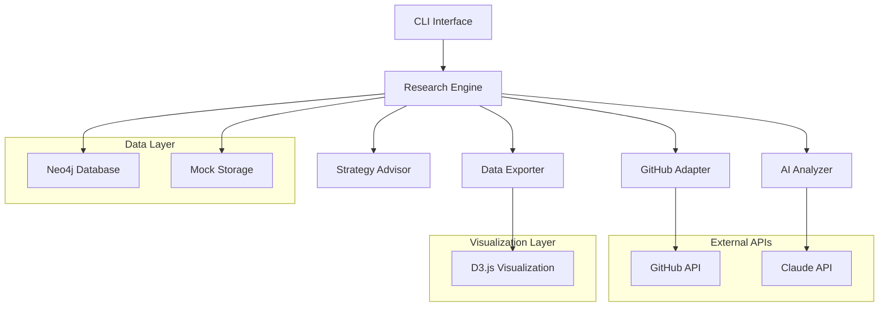
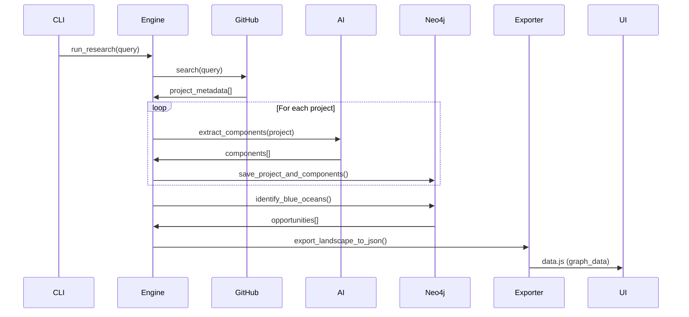

# Design Document

## Overview

The Wheel is an AI-assisted research engine that maps the software landscape through intelligent graph analysis. The system combines GitHub API integration, Claude AI-powered component analysis, Neo4j graph storage, and D3.js visualization to help developers discover existing solutions, analyze competitive landscapes, and identify market opportunities.

The architecture follows a modular design with clear separation between data collection, analysis, storage, and visualization layers. The system supports both production mode with Neo4j and mock mode for development, ensuring rapid iteration during the hackathon sprint.

## Architecture

The system follows a layered architecture with the following components:



### Key Architectural Decisions

1. **Adapter Pattern**: GitHub integration uses adapter pattern to enable future extension to other platforms (GitLab, PyPI, etc.)
2. **Strategy Pattern**: AI analysis supports both Claude API and fallback keyword extraction
3. **Mock Mode**: Complete mock implementation enables development without Neo4j dependency
4. **Graph-First Design**: All data relationships modeled as graph structures from the start
5. **Stateless Processing**: Each research session is independent, enabling parallel processing

## Components and Interfaces

### Research Engine (src/main.py)

The central orchestrator that coordinates all system components.

**Key Methods:**
- `run_research(query: str, limit: int)`: Main entry point for research workflow
- `link_components_to_project(project: Dict)`: Helper for graph relationship creation

**Dependencies:**
- GitHubAdapter for project discovery
- ProjectAnalyzer for component extraction
- StrategyAdvisor for market analysis
- DataExporter for visualization preparation

### GitHub Adapter (src/engine/github_adapter.py)

Handles GitHub API integration and project metadata extraction.

**Interface:**
```python
class GitHubAdapter(BaseCollector):
    def search(self, query: str, filters: Dict = None) -> List[Dict]
    def extract_metadata(self, raw_data: Dict) -> Dict
    def save_to_graph(self, project_data: Dict)
```

**Key Features:**
- Rate limit handling and error recovery
- Configurable result filtering (language, stars, etc.)
- Standardized metadata extraction
- Direct Neo4j persistence

### AI Analyzer (src/engine/analyzer.py)

Extracts reusable components from project descriptions using AI analysis.

**Interface:**
```python
class ProjectAnalyzer:
    def extract_components(self, project_data: Dict) -> List[Dict]
    def get_ai_extraction_prompt(self, project_data: Dict) -> str
```

**Analysis Strategy:**
1. **Primary**: Claude API with structured prompts for component identification
2. **Fallback**: Keyword-based heuristic extraction for reliability
3. **Component Categories**: Interface, Storage, Security, Frontend, DevOps

**AI Integration Pattern:**
```python
# Structured prompt for Claude API
prompt = f"""
Analyze this software project and identify reusable components:

Project: {project['name']}
Description: {project['description']}
Topics: {project['topics']}

Return JSON array of components:
[{{"name": "Component Name", "type": "Category", "description": "Reuse potential"}}]
"""
```

### Strategy Advisor (src/engine/strategy.py)

Analyzes the project graph to identify Blue Ocean opportunities and competitive insights.

**Interface:**
```python
class StrategyAdvisor:
    def identify_blue_oceans(self) -> List[Dict]
    def propose_pivots(self, project_name: str) -> str
```

**Blue Ocean Algorithm:**
- Calculates `blue_ocean_score = project_count / (component_count + 1)`
- Higher scores indicate areas with many projects but low component standardization
- Represents market opportunities for creating reusable solutions

### Neo4j Connection (src/data/connection.py)

Provides unified interface for both production Neo4j and mock mode operations.

**Interface:**
```python
class Neo4jConnection:
    def connect(self, uri: str, user: str, password: str)
    def get_session(self) -> Session
```

**Mock Mode Implementation:**
- In-memory storage mimicking Neo4j structure
- Same query interface as production mode
- Enables complete testing without database dependency

### Data Exporter (src/data/exporter.py)

Converts Neo4j graph data to D3.js-compatible JSON format.

**Export Format:**
```javascript
const graphData = {
  "nodes": [
    {"id": 1, "name": "Project Name", "type": "Project", "url": "..."},
    {"id": 2, "name": "Component Name", "type": "Component"}
  ],
  "links": [
    {"source": 1, "target": 2, "type": "USES"}
  ]
};
```

## Data Models

### Neo4j Graph Schema

The graph database uses the following node types and relationships:

**Node Types:**
- `Project`: Software repositories with metadata (name, stars, description, language)
- `Author`: Repository owners and contributors (username)
- `Component`: Reusable software building blocks (name, type, description)
- `Topic`: GitHub topics and tags (name)

**Relationships:**
- `(Author)-[:CREATED]->(Project)`: Authorship relationships
- `(Project)-[:USES]->(Component)`: Component dependencies
- `(Project)-[:TAGGED_WITH]->(Topic)`: Topic associations
- `(Component)-[:SIMILAR_TO]->(Component)`: Component similarity (future)

**Schema Definition (src/data/schema.cypher):**
```cypher
// Constraints for data integrity
CREATE CONSTRAINT project_url IF NOT EXISTS FOR (p:Project) REQUIRE p.url IS UNIQUE;
CREATE CONSTRAINT author_username IF NOT EXISTS FOR (a:Author) REQUIRE a.username IS UNIQUE;
CREATE CONSTRAINT component_name IF NOT EXISTS FOR (c:Component) REQUIRE c.name IS UNIQUE;
CREATE CONSTRAINT topic_name IF NOT EXISTS FOR (t:Topic) REQUIRE t.name IS UNIQUE;

// Indexes for performance
CREATE INDEX project_stars IF NOT EXISTS FOR (p:Project) ON (p.stars);
CREATE INDEX project_language IF NOT EXISTS FOR (p:Project) ON (p.primary_language);
```

### Component Classification

Components are categorized using a standardized taxonomy:

- **Interface**: APIs, CLIs, SDKs, protocols
- **Storage**: Databases, caches, file systems, serialization
- **Security**: Authentication, authorization, encryption, validation
- **Frontend**: UI frameworks, visualization libraries, styling systems
- **DevOps**: Containerization, CI/CD, monitoring, deployment tools
- **Processing**: Data processing, algorithms, business logic engines

### Data Flow Architecture



## Correctness Properties

*A property is a characteristic or behavior that should hold true across all valid executions of a system-essentially, a formal statement about what the system should do. Properties serve as the bridge between human-readable specifications and machine-verifiable correctness guarantees.*

Before defining the correctness properties, I need to analyze the acceptance criteria from the requirements document to determine which are testable as properties.

### Converting EARS to Properties

Based on the prework analysis, I'll convert the testable acceptance criteria into universally quantified properties:

**Property 1: GitHub API Integration**
*For any* valid search query, the GitHub_Adapter should successfully make API calls and return results within the configured limit, handling rate limits gracefully.
**Validates: Requirements 1.1, 1.3, 1.4**

**Property 2: Metadata Extraction Completeness**
*For any* valid GitHub API response, the GitHub_Adapter should extract all required metadata fields (name, description, stars, author, language, topics) without missing data.
**Validates: Requirements 1.2**

**Property 3: Component Extraction and Categorization**
*For any* project description, the AI_Analyzer should extract components and assign each component a valid category type from the allowed set (Interface, Storage, Security, Frontend, DevOps).
**Validates: Requirements 2.1, 2.2**

**Property 4: AI Fallback Reliability**
*For any* project when AI analysis fails, the AI_Analyzer should fall back to keyword-based extraction and produce valid component results.
**Validates: Requirements 2.3**

**Property 5: Graph Data Persistence**
*For any* collected project data, the Research_Engine should create all required nodes (Project, Author, Component, Topic) and relationships (CREATED, USES, TAGGED_WITH) in the Graph_Database with complete properties.
**Validates: Requirements 3.1, 3.2, 3.3, 3.4**

**Property 6: Component Deduplication**
*For any* set of projects with duplicate component names, the Research_Engine should merge identical components and maintain relationships to all associated projects.
**Validates: Requirements 2.5**

**Property 7: Mock Mode Equivalence**
*For any* operation sequence, running in Mock_Mode should produce the same logical results as Neo4j mode, maintaining identical data structures and interfaces.
**Validates: Requirements 6.1, 6.2, 6.3, 6.4, 6.5**

**Property 8: Blue Ocean Calculation Consistency**
*For any* graph state with sufficient data, the Strategy_Advisor should calculate Blue Ocean scores using the formula (project_count / (component_count + 1)) and return results ranked by score.
**Validates: Requirements 4.1, 4.2, 4.5**

**Property 9: Export Data Validation**
*For any* graph export operation, the generated JSON should contain only valid nodes with required properties (id, name, type) and links with non-null targets.
**Validates: Requirements 7.1, 7.2, 7.3, 7.4, 7.5**

**Property 10: Visualization Statistics Accuracy**
*For any* exported dataset, the visualization statistics should accurately reflect the actual count of nodes and links in the data.
**Validates: Requirements 5.5**

**Property 11: Error Handling Resilience**
*For any* component failure (GitHub API, Neo4j, AI, file operations), the system should handle errors gracefully, provide descriptive messages, and prevent cascading failures.
**Validates: Requirements 8.1, 8.2, 8.3, 8.4, 8.5**

**Property 12: Input Validation**
*For any* invalid search query or insufficient data condition, the system should return appropriate error messages or warnings without crashing.
**Validates: Requirements 1.5, 4.4**

## Error Handling

The system implements comprehensive error handling across all layers:

### GitHub API Error Handling
- **Rate Limiting**: Exponential backoff with jitter for rate limit recovery
- **Network Failures**: Retry logic with circuit breaker pattern
- **Invalid Responses**: Graceful degradation with partial results
- **Authentication Errors**: Clear messaging for API key configuration

### Neo4j Database Error Handling
- **Connection Failures**: Automatic fallback to mock mode with user notification
- **Query Errors**: Transaction rollback and detailed error logging
- **Constraint Violations**: Duplicate detection and merge operations
- **Performance Issues**: Query timeout handling and optimization suggestions

### AI Analysis Error Handling
- **API Failures**: Automatic fallback to keyword-based extraction
- **Rate Limiting**: Queue management and batch processing
- **Invalid Responses**: Response validation and retry logic
- **Timeout Handling**: Graceful degradation with partial analysis

### File System Error Handling
- **Permission Errors**: Clear messaging about file access requirements
- **Path Issues**: Automatic directory creation and path validation
- **Disk Space**: Storage validation before large operations
- **Concurrent Access**: File locking and atomic operations

### System Resilience Patterns
- **Circuit Breaker**: Prevents cascading failures between components
- **Bulkhead**: Isolates failures to prevent system-wide impact
- **Timeout**: Prevents hanging operations from blocking the system
- **Graceful Degradation**: Maintains core functionality when components fail

## Testing Strategy

The testing strategy employs a dual approach combining unit tests for specific scenarios and property-based tests for comprehensive coverage.

### Property-Based Testing Configuration

The system uses **Hypothesis** for Python property-based testing with the following configuration:
- **Minimum 100 iterations** per property test to ensure statistical confidence
- **Shrinking enabled** to find minimal failing examples
- **Deterministic seeds** for reproducible test runs during development
- **Custom generators** for domain-specific data (GitHub responses, project metadata)

Each property test references its corresponding design document property using the tag format:
**Feature: the-wheel, Property {number}: {property_text}**

### Unit Testing Strategy

Unit tests focus on:
- **Specific Examples**: Concrete test cases that demonstrate correct behavior
- **Edge Cases**: Boundary conditions and corner cases
- **Integration Points**: Component interaction verification
- **Error Conditions**: Specific failure scenarios and recovery

### Test Data Management

**Mock Data Generation**:
- GitHub API response fixtures for consistent testing
- Synthetic project metadata covering edge cases
- Component extraction test cases with known outputs
- Graph state fixtures for Blue Ocean analysis testing

**Property Test Generators**:
```python
@given(
    query=st.text(min_size=1, max_size=100),
    limit=st.integers(min_value=1, max_value=50)
)
def test_github_search_respects_limit(query, limit):
    # Property 1: GitHub API Integration
    pass
```

### Testing Environment Setup

**Development Testing**:
- Mock mode enabled by default for fast test execution
- In-memory Neo4j for integration tests requiring graph operations
- Stubbed external APIs to prevent rate limiting during tests

**CI/CD Testing**:
- Full Neo4j instance for end-to-end validation
- Rate-limited external API calls for integration verification
- Performance benchmarks for regression detection

### Coverage Requirements

- **Unit Test Coverage**: Minimum 80% line coverage for all modules
- **Property Test Coverage**: All correctness properties implemented as tests
- **Integration Coverage**: End-to-end workflows validated
- **Error Path Coverage**: All error handling paths tested

The testing strategy ensures both correctness (through property-based testing) and reliability (through comprehensive unit testing), providing confidence for the hackathon deployment and future development.